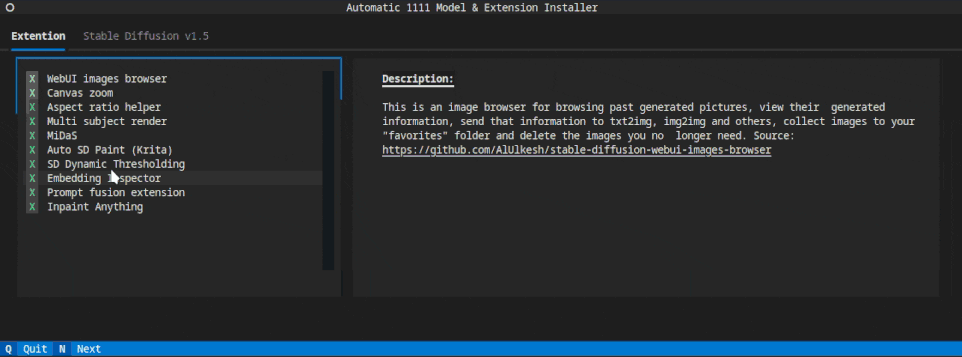

# InstallIt textual

A simple customizable installer based on the Textual library.

My first goal was to test the new python framework [Textual](https://github.com/Textualize/textual).
So I made this installer that take a bunch of YAML file an generate a nice 
[TUI](https://en.wikipedia.org/wiki/Text-based_user_interface) that allows the
user to chose what to install.

And to apply it to something more concrete I applied it on a extension/model auto
installer for [Automatic1111](https://github.com/AUTOMATIC1111/stable-diffusion-webui)
for Stable Diffusion on [RunPod](https://www.runpod.io/)



it is fully customizable, in a sens that etch install option (called `opt` in 
the code) come from a yaml file. The each `opt` entry can have git repos, files
to download and shell commands.

## YAML structure
### Options

All the option the user can chose from are stored in a yaml file. each file will
be load in a tab in the selection screen. The tab name will be the file name
with the extension ``.yml`` or ``.yaml`` and with `_` if any replaced by space.
The structure of the file is

```yaml
option_unique_name:
  name: My option  # the name displayed to the user
  description: >   # the description displayed to the user
    a description text, it will be interpreted as markdown. because of the way
    yaml and markdown multiline operator `>`interprets line break, to have an
    actual line break in the display description, one need to add 2 line breaks

    see https://textual.textualize.io/widgets/markdown/ for how Textual handles
    markdown text.

    **source**: https://www.baeldung.com/yaml-multi-line

  files: # list of file to download
    - file_id_1:
        url: "example.com/file1"   # source of the file
        path: "$MAIN_PATH$/file1"  # target
    - file_id_1:

        url: "example.com/file2"   # source of the file
        path: "$MAIN_PATH$/file2"  # target

  repos:
    - repos_id_1: # list of repos to clone
        url: "https://github.com/symartin/installit-textual.git"
        path: "$MAIN_PATH$/installit-textual"

  cmd: # list of shell commands to run
    - "ls -ll" # the command to run

  default: True  # if true, the option will be enabled by default

```

### Constant file ``.cst``
Special config files can have a list of constants to replace in the yaml file.
those config files need to ave `.cst` in their name.

```yaml
MAIN_PATH: ~/
SUB_FOLDER: $MAIN_PATH$/installit-textual
```

Those constants will be used by the installer to replace the values in the yaml.
all the string of the yaml file will be recursively replaced by the values of 
the constants. It allow to use constants in constant declaration. To be treated 
as a replaceable constant, the string must be between dollar signs `$`.

#### Special `app.cst.yml`
this file is a special config file that is used to setup the app. At the moment
only one key is used: `TITLE`, to change the application title.